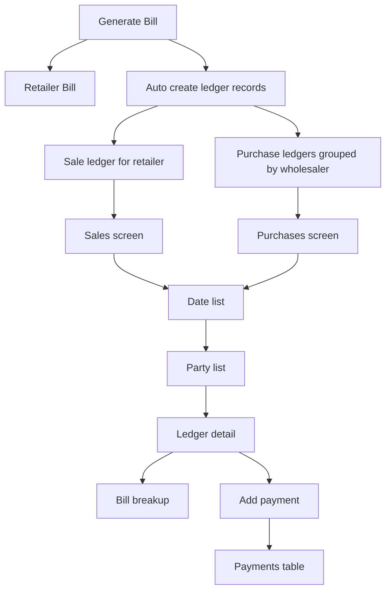

# Kirana App

Kirana App is an offline-first Flutter ERP for small retailers. It uses Drift/SQLite for local-only storage, models stock as wholesaler purchase sources, generates retail bills and PDFs, and keeps purchase/sale ledgers plus payment history entirely on device.

This README is the compact bootstrap document for an AI coding assistant. It is intended to replace the older scattered context files as the first thing a model should read before making changes.

## If You Are An AI Assistant

Read this first and keep these boundaries in mind:

- Preserve the current purchase-source billing flow.
- Do not rework the purchase-source backend, inventory migration, PDF generation, or ledger tables unless explicitly asked.
- Prefer the existing services, providers, and shared UI helpers over creating new parallel flows.
- Keep payment history additive. Do not delete old payment rows when applying a new payment.
- Treat the ledger detail, breakup, and payment screens as the canonical workflow for purchase and sales cash flow.
- Use the current design system in `lib/theme/` and the shared widgets in `lib/widgets/`.

## Project At A Glance

The app opens on the dashboard and exposes these modules:

- Billing (POS)
- Inventory
- Retailers
- Wholesalers
- Purchases
- Sales
- Analytics
- Reports & Backups

Current behavior is desktop-friendly and table-first in most list views. The project uses DataTable2 for dense ledgers and master-data screens, and Syncfusion charts for analytics.

## High-Level Architecture

- Flutter + Dart UI with Riverpod state management.
- Drift-backed SQLite database stored locally on the device.
- Native file-based storage through `path_provider` and `sqlite3_flutter_libs`.
- PDF invoice generation and printing support through `pdf` and `printing`.
- Desktop-friendly UI patterns built around tables, cards, and shared dialogs.

Primary app entrypoints and wiring:

- [lib/main.dart](lib/main.dart)
- [lib/core/providers.dart](lib/core/providers.dart)
- [lib/database/database.dart](lib/database/database.dart)
- [lib/theme/kirana_theme.dart](lib/theme/kirana_theme.dart)

## Current Business Model

The current business model is:

Wholesaler -> Purchase Source -> Retail Sale

The app no longer treats owned inventory as the source of truth. Instead, each item can have one or more purchase sources with purchase price, GST, bardana, and optional quantity.

Important detail:

- A quantity marked as N/A means the source is not quantity-limited or not applicable.
- Retail-facing billing should not expose the wholesaler purchase chain.
- Internal tracking can still use purchase-source ids and bill item source rows.

## Flow Diagram



## Key Workflows

### Billing

Billing is handled through the POS flow in `lib/features/billing/`.

What happens when a bill is generated:

- The retailer bill is inserted into `retailer_bills`.
- Bill items are inserted into `retailer_bill_items`.
- Purchase sources are resolved per item when selected.
- Internal bill-item source rows are written to `bill_item_sources`.
- Inventory quantity is reduced where the source is quantity-bound.
- A sale ledger is created for the retailer.
- Purchase ledgers are created per wholesaler, grouped and aggregated by amount.

Relevant files:

- [lib/features/billing/billing_screen.dart](lib/features/billing/billing_screen.dart)
- [lib/features/billing/billing_service.dart](lib/features/billing/billing_service.dart)
- [lib/features/billing/cart_provider.dart](lib/features/billing/cart_provider.dart)

### Inventory

Inventory is now item-centric and purchase-source-centric rather than stock-room-centric.

Typical inventory flow:

- Add or edit an item.
- Open an item to inspect its purchase sources.
- Add or edit a purchase source for a wholesaler.
- Use numeric quantity or mark quantity as N/A.

Relevant files:

- [lib/features/inventory/inventory_screen.dart](lib/features/inventory/inventory_screen.dart)
- [lib/features/inventory/items_service.dart](lib/features/inventory/items_service.dart)
- [lib/features/inventory/purchase_sources_service.dart](lib/features/inventory/purchase_sources_service.dart)

### Purchases And Sales Ledger Flow

The ledger workflow is now structured as:

Date list -> Party list -> Ledger detail -> Breakup -> Payments

For purchases:

- The first screen groups ledgers by date.
- Tapping a date shows the wholesaler list for that date.
- The row shows name, total purchase, amount paid, remaining amount, interest, payment mode, and fully paid state.

For sales:

- The first screen groups ledgers by date.
- Tapping a date shows the retailer list for that date.
- The row shows retailer name, total sale, amount paid, remaining amount, interest, payment mode, and fully paid state.

In the ledger detail screen:

- Bill date is shown.
- Item breakup is shown through the ledger breakup query.
- Payment history is displayed newest-first.
- Payments can be applied without overwriting old rows.

Relevant files:

- [lib/features/ledger/purchases_screen.dart](lib/features/ledger/purchases_screen.dart)
- [lib/features/ledger/sales_screen.dart](lib/features/ledger/sales_screen.dart)
- [lib/features/ledger/ledger_detail_screen.dart](lib/features/ledger/ledger_detail_screen.dart)
- [lib/features/ledger/ledger_service.dart](lib/features/ledger/ledger_service.dart)

### Reports

Reports lists all generated bills and can regenerate the PDF invoice for a bill.

Relevant files:

- [lib/features/reports/reports_screen.dart](lib/features/reports/reports_screen.dart)
- [lib/features/reports/reports_service.dart](lib/features/reports/reports_service.dart)
- [lib/services/pdf_service.dart](lib/services/pdf_service.dart)

### Analytics

Analytics currently aggregates retailer sales and wholesaler purchase data for charts and KPI cards.

Relevant files:

- [lib/features/analytics/analytics_screen.dart](lib/features/analytics/analytics_screen.dart)
- [lib/features/analytics/analytics_service.dart](lib/features/analytics/analytics_service.dart)

## Data Model

Main tables in `lib/database/tables.dart`:

- `items` - product catalog.
- `wholesalers` - source businesses supplying stock.
- `retailers` - customers buying goods.
- `wholesaler_inventory` - legacy stock table kept for migration and compatibility.
- `item_purchase_sources` - normalized item-to-wholesaler purchase terms.
- `retailer_bills` - retail invoices.
- `retailer_bill_items` - bill line items.
- `bill_item_sources` - internal source mapping for bill items.
- `ledgers` - purchase and sale balances.
- `payments` - additive payment history for ledgers.
- `inventory_transactions` - movement log for IN and OUT activity.

Important schema note:

- The app is in a transitional schema state.
- `item_purchase_sources` is the normalized model.
- `bill_item_sources` still carries legacy compatibility fields so older databases keep working.
- Live databases may still enforce `bill_item_sources.inventory_id`, so billing writes a legacy mirror row when required.

## Database And Migration Notes

The database lives in [lib/database/database.dart](lib/database/database.dart) and uses Drift migrations.

Current database behavior:

- Schema version is `2`.
- Migration converts legacy `wholesaler_inventory` rows into `item_purchase_sources`.
- Existing `bill_item_sources.inventory_id` data is backfilled into `purchase_source_id` where possible.
- `clearAllData()` deletes rows in dependency-safe order and resets SQLite autoincrement counters so invoices restart from `#1` after a full wipe.

Generated code:

- [lib/database/database.g.dart](lib/database/database.g.dart) is generated by Drift and should not be edited manually.

## Services That Control The Main Behavior

These are the services most likely to matter when modifying app behavior:

- [lib/features/billing/billing_service.dart](lib/features/billing/billing_service.dart) - generates bills, bill items, bill item sources, inventory deductions, and ledger rows.
- [lib/features/ledger/ledger_service.dart](lib/features/ledger/ledger_service.dart) - fetches ledgers, breakup rows, payment history, migration stats, and applies payments.
- [lib/features/reports/reports_service.dart](lib/features/reports/reports_service.dart) - loads bills for the reports screen.
- [lib/features/analytics/analytics_service.dart](lib/features/analytics/analytics_service.dart) - prepares chart data and KPI totals.

Ledger service methods that already exist and should usually be reused:

- `getLedgersByTypeAndDate`
- `getLedgersForDate`
- `getLedgerBreakup`
- `getPaymentsForLedger`
- `getMigrationReport`
- `applyPayment`

Billing service methods that matter:

- `generateRetailerBill`
- `_createLegacyInventoryMirror`

## Theme And UI System

The current UI theme is centralized under `lib/theme/` and should be treated as the source of truth for styling.

Color palette in `lib/theme/app_colors.dart`:

- espresso `#3E2010`
- coffee `#6F4E37`
- caramel `#C08552`
- honey `#EEC373`
- biscuit `#F4DFBA`
- cream `#FBF0E3`
- ivory `#FBF6EF`

Typography in `lib/theme/app_text_styles.dart`:

- Merriweather for headings.
- Lato for body and captions.

Shared UI helpers:

- `CommonAppBar`
- `showCommonDialog`
- `showCommonSnackbar`
- `KiranaCard`
- `KiranaItemTile`

Other current UI conventions:

- Use DataTable2 for dense master-data and ledger views.
- Use Card-based summaries for dashboard and KPI-style sections.
- Keep row actions and payment dialogs consistent with the shared dialog helpers.

Relevant files:

- [lib/theme/kirana_theme.dart](lib/theme/kirana_theme.dart)
- [lib/theme/app_colors.dart](lib/theme/app_colors.dart)
- [lib/theme/app_text_styles.dart](lib/theme/app_text_styles.dart)
- [lib/widgets/common_widgets.dart](lib/widgets/common_widgets.dart)
- [lib/widgets/kirana_card.dart](lib/widgets/kirana_card.dart)

## Dashboard Navigation

The dashboard is the main navigation hub and includes dedicated tiles for:

- Billing (POS)
- Inventory
- Retailers
- Wholesalers
- Analytics
- Reports & Backups
- Purchases
- Sales

Relevant file:

- [lib/features/dashboard/dashboard_screen.dart](lib/features/dashboard/dashboard_screen.dart)

## Current Implementation Snapshot

What is already present in the current codebase:

- Billing uses purchase sources and still preserves legacy compatibility when needed.
- Sale ledgers are created for retailers after bill generation.
- Purchase ledgers are created per wholesaler after bill generation.
- Purchase and sales screens now expose date grouping, party lists, ledger detail, and payment entry.
- Ledger detail shows payment history and supports additive payment updates.
- Reports lists bills and can regenerate PDFs.
- Analytics uses charting and monthly aggregates.
- The theme has been centralized and the app uses a warm coffee-and-beige visual language.

Historical compatibility note:

- A previous runtime issue involved `bill_item_sources.inventory_id` being non-null in older SQLite files.
- The current implementation keeps a legacy inventory mirror where required so the app continues to work with transitional databases.

## Known Constraints And Risks

- Do not duplicate the existing ledger tables.
- Do not rework migration logic unless a concrete compatibility bug forces it.
- Do not expose wholesaler purchase chains in retail-facing screens.
- Do not overwrite previous payment rows when recording a new payment.
- Be careful with older rows that may still reference legacy inventory ids.
- Treat analytics calculations as reporting logic, not as the canonical accounting source, because parts of it still bridge legacy inventory data.

## Validation And Environment Notes

Standard local commands:

```bash
flutter pub get
flutter pub run build_runner build --delete-conflicting-outputs
flutter analyze
flutter test
flutter run
```

Current validation context from recent work:

- `flutter analyze` is clean for the ledger and database areas touched in the current work, aside from unrelated legacy info warnings in `lib/services/pdf_service.dart`.
- `flutter run -d windows` currently fails in the Windows toolchain with an MSB3073 install-step error that appears environmental rather than app-code related.

Platform note:

- The app uses `dart:io` and native SQLite, so the real target is mobile and desktop. The generated web shell exists because it is part of the Flutter scaffold, but the current storage layer is not web-first.

## Suggested Reading Order For Future Work

If you are continuing development, start here:

1. [lib/main.dart](lib/main.dart)
2. [lib/core/providers.dart](lib/core/providers.dart)
3. [lib/database/database.dart](lib/database/database.dart)
4. [lib/database/tables.dart](lib/database/tables.dart)
5. [lib/features/billing/billing_service.dart](lib/features/billing/billing_service.dart)
6. [lib/features/ledger/ledger_service.dart](lib/features/ledger/ledger_service.dart)
7. [lib/features/ledger/ledger_detail_screen.dart](lib/features/ledger/ledger_detail_screen.dart)
8. [lib/theme/kirana_theme.dart](lib/theme/kirana_theme.dart)

## Repository Layout

Main directories in the workspace:

- `lib/` - application source code.
- `android/`, `ios/`, `linux/`, `macos/`, `windows/` - Flutter platform targets.
- `web/` - Flutter scaffold output; not the primary storage target.
- `build/` - generated build artifacts.
- `test/` - widget and unit tests.

Important source subfolders:

- `lib/core/` - providers and app wiring.
- `lib/database/` - tables, generated database access, and migrations.
- `lib/features/billing/` - POS flow and bill creation.
- `lib/features/inventory/` - items and purchase-source management.
- `lib/features/ledger/` - purchases, sales, ledger detail, and payment entry.
- `lib/features/reports/` - invoice list and PDF regeneration.
- `lib/features/analytics/` - charts and aggregates.
- `lib/features/dashboard/` - home screen navigation.
- `lib/theme/` - colors, typography, and shared theme helpers.
- `lib/widgets/` - common UI building blocks.

## Short History Of Recent Changes

This is the condensed history that matters for future edits:

- The project moved from legacy inventory thinking to normalized purchase sources.
- Billing was updated to select and persist purchase-source data while still writing compatibility rows for old databases.
- Purchase and sales ledger UI was added for date-wise grouping, party lists, breakup details, and payment entry.
- Payment history is stored additively.
- The app theme was centralized around a warm coffee-and-beige visual system.
- Dashboard navigation now exposes purchases and sales directly.

## Files Most Likely To Matter Next

- [lib/features/ledger/ledger_service.dart](lib/features/ledger/ledger_service.dart)
- [lib/features/ledger/purchases_screen.dart](lib/features/ledger/purchases_screen.dart)
- [lib/features/ledger/sales_screen.dart](lib/features/ledger/sales_screen.dart)
- [lib/features/ledger/ledger_detail_screen.dart](lib/features/ledger/ledger_detail_screen.dart)
- [lib/features/billing/billing_service.dart](lib/features/billing/billing_service.dart)
- [lib/database/database.dart](lib/database/database.dart)
- [lib/theme/kirana_theme.dart](lib/theme/kirana_theme.dart)

If you need one compact mental model for the app, use this:

Bill generation drives ledger creation. Ledger screens drive payment updates and breakup visibility. The database is local-first and transitional between legacy inventory and normalized purchase sources. The theme and shared widgets are already centralized, so new work should fit into that structure instead of creating another parallel UI style.
